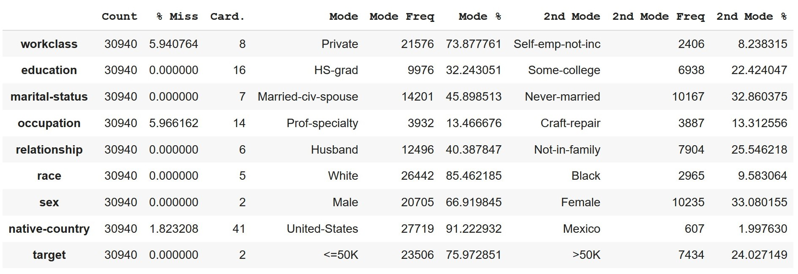
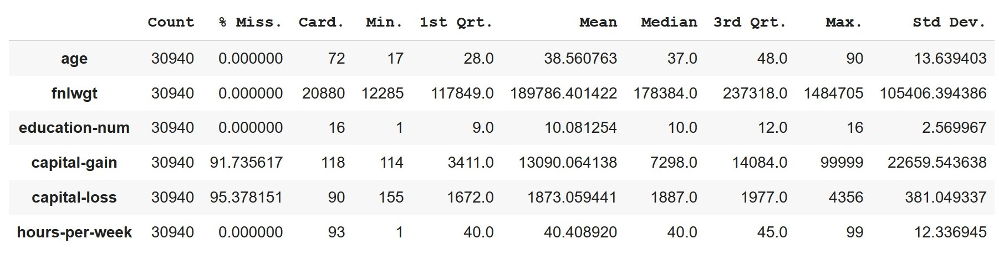

# Data-Profiling-with-Pandas
🐍🐼📊 Profiling the 1994 US Census with Pandas  

  

This code splits the dataset into categorical and continuous feature tables and providing a data quality report.

### Categorical Data Quality Report

### Continuous Data Quality Report

